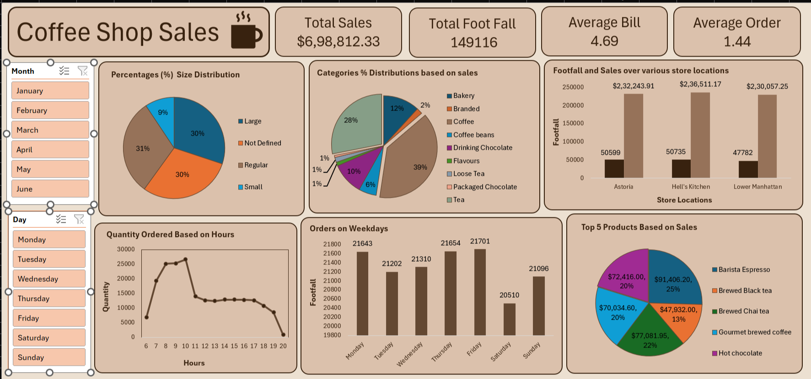

# ☕ Coffee Shop Sales Dashboard

## 📌 Project Overview

The **Coffee Shop Sales Dashboard** is an interactive business intelligence project developed in **Microsoft Excel** to analyze retail sales data and generate actionable business insights.

This dashboard uses **Power Query, Power Pivot, Pivot Tables, Pivot Charts, KPI Cards, and Slicers** to transform raw retail sales data into meaningful business insights.

---

# 🎯 Business Objective

This dashboard answers key business questions:

- Which store generates the highest revenue?
- Which products contribute the most sales?
- What are the busiest business hours?
- Which weekday attracts the highest customer footfall?
- What is the average customer bill?
- Which products and categories perform the best?

---

# 🖼 Dashboard Preview

---

# 🛠 Tools & Technologies

- Microsoft Excel
- Power Query
- Power Pivot
- Pivot Tables
- Pivot Charts
- KPI Cards
- Slicers
- Data Cleaning
- Data Transformation
- Data Visualization

---

# 🔄 Project Workflow

1. Collected raw sales data.
2. Cleaned and transformed data using Power Query.
3. Built the data model with Power Pivot.
4. Created Pivot Tables and Pivot Charts.
5. Designed an interactive dashboard with KPI Cards and Slicers.
6. Generated business insights and recommendations.

---

# 📊 Dashboard KPIs

| KPI | Value |
|------|-------:|
| Total Sales | **$698,812.33** |
| Total Footfall | **149,116** |
| Average Bill | **$4.69** |
| Average Orders | **1.44** |

---

# 📈 Dashboard Features

- Interactive Month Filter
- Weekday Filter
- KPI Cards
- Store-wise Sales Analysis
- Product Category Analysis
- Product Size Distribution
- Top Selling Products
- Quantity Ordered by Hour
- Orders by Weekday

---

# 📌 Business Questions & Analysis

## 1. How do sales vary by day of the week and hour of the day?

**Analysis:** Sales peak between **8:00 AM and 10:00 AM**. Friday has the highest customer footfall, while Saturday has the lowest.

**Recommendation:** Increase staffing during morning hours and run weekend promotions.

---

## 2. Are there any peak times for sales activity?

**Analysis:** Peak sales occur from **8 AM to 10 AM**.

**Recommendation:** Ensure sufficient inventory and faster service during peak hours.

---

## 3. What is the total sales revenue for each month?

**Analysis:** The dashboard includes a Month Slicer for month-wise analysis.

**Overall Sales Revenue:** **$698,812.33**

**Recommendation:** Monitor monthly trends for better planning.

---

## 4. How do sales vary across different store locations?

| Store | Revenue |
|--------|---------:|
| Hell's Kitchen | **$236,511.17** |
| Astoria | $232,243.91 |
| Lower Manhattan | $230,057.25 |

**Recommendation:** Apply successful strategies from Hell's Kitchen to other stores.

---

## 5. What is the average bill per customer?

- Average Bill: **$4.69**
- Average Orders: **1.44**

**Recommendation:** Introduce combo offers and cross-selling.

---

## 6. Which products generate the highest revenue?

| Product | Revenue |
|----------|---------:|
| Barista Espresso | **$91,406.20** |
| Brewed Chai Tea | $77,081.95 |
| Hot Chocolate | $72,416.00 |
| Gourmet Brewed Coffee | $70,034.60 |
| Brewed Black Tea | $47,932.00 |

---

## 7. How do sales vary by product category?

| Category | Share |
|----------|------:|
| Coffee | 39% |
| Tea | 28% |
| Bakery | 12% |
| Drinking Chocolate | 10% |
| Coffee Beans | 6% |
| Branded Products | 2% |
| Others | 3% |

**Recommendation:** Focus on beverages while promoting lower-selling categories.

---

# 💡 Key Insights

- Total Sales: **$698,812.33**
- Total Footfall: **149,116**
- Hell's Kitchen is the top-performing store.
- Friday is the busiest weekday.
- Peak sales occur between **8–10 AM**.
- Coffee contributes **39%** of revenue.
- Tea contributes **28%** of revenue.
- Barista Espresso is the top-selling product.

---

# 📢 Business Recommendations

- Increase staff during peak hours.
- Maintain inventory for high-demand products.
- Cross-sell bakery items with beverages.
- Launch weekend promotions.
- Monitor monthly trends.

---

# 🚀 Skills Demonstrated

- Microsoft Excel
- Power Query
- Power Pivot
- Pivot Tables
- Pivot Charts
- Dashboard Development
- Data Cleaning
- Data Transformation
- Business Analysis
- Data Visualization

---

# 📌 Conclusion

This project demonstrates how Microsoft Excel can be used to build an interactive Business Intelligence dashboard from raw retail sales data. The dashboard helps identify trends, monitor KPIs, evaluate store performance, and support data-driven business decisions.

---

# 👨‍💻 Author

**Sunny Chawla**

Aspiring Data Analyst

### Connect with Me

- GitHub: https://github.com/sunnychawla1711
- LinkedIn: https://www.linkedin.com/in/sunny-chawla1711/

---

⭐ If you found this project useful, consider giving it a Star.
